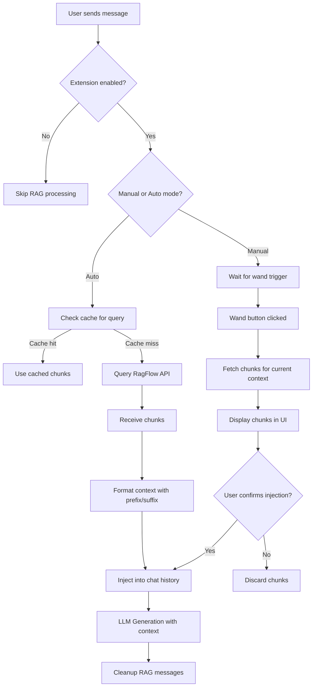
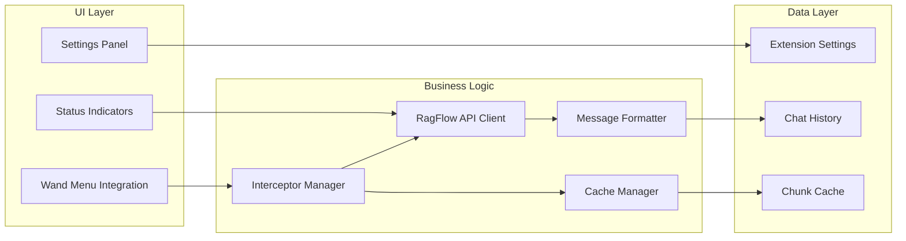

# RAGFlow Lore Injector - Improvement Plan

## Problem Analysis

### Current Issues Identified

1. **Automatic Injection Not Working**
   - Chunks are fetched successfully but not appearing in prompts
   - Possible causes:
     - Interceptor timing issues (called too early/late)
     - Message structure incompatibility with SillyTavern
     - Insertion point logic incorrect
     - Cleanup removing messages before they're used

2. **No Manual Control**
   - Can't manually trigger RAG queries when needed
   - No integration with SillyTavern's wand/macro system

3. **No Per-Chat Configuration**
   - Extension is either on or off globally
   - Cannot have different modes for different chats
   - Need flexibility: disabled for some chats, auto for others, manual for others

## Proposed Solution Architecture

### Flow Diagram



### Component Architecture



## Implementation Plan

### Phase 1: Fix Automatic Injection

**Changes to `index.js`:**

1. **Improve Interceptor Logic**
   - Add more detailed logging to track execution
   - Verify message structure matches SillyTavern expectations
   - Test different insertion points
   - Add timing checks

2. **Fix Message Structure**
   ```javascript
   // Current structure might be missing required fields
   const systemNote = {
       is_user: false,
       is_system: true,
       name: "RAGFlow",
       send_date: Date.now(),
       mes: fullText,
       // Add these potentially missing fields:
       extra: {
           type: 'ragflow_injection',
           created: Date.now(),
           can_edit: false  // Prevent editing
       }
   };
   ```

3. **Adjust Cleanup Timing**
   - Move cleanup to happen AFTER prompt is sent but BEFORE response
   - Or keep messages but mark them as hidden from UI

4. **Add Debug Mode**
   - Toggle to show all RAG operations in console
   - Display exactly where messages are injected
   - Show final prompt structure

### Phase 2: Add Manual Trigger (Wand Menu)

**New Features:**

1. **Wand Menu Integration**
   - Add custom macro: `/ragflow` or `/rf`
   - Add button to wand menu: "Fetch RAG Context"
   - Show preview of chunks before injection

2. **Manual Mode Settings**
   - Toggle: Auto vs Manual mode
   - In Manual mode: only fetch when triggered
   - In Auto mode: fetch on every message (current behavior)

3. **UI Enhancements**
   - Status indicator showing RAG state
   - Preview modal for fetched chunks
   - Confirm before inject option

### Phase 3: Improved Error Handling & Feedback

1. **Better Error Messages**
   - Specific error types (network, parsing, injection)
   - User-friendly error descriptions
   - Suggested fixes

2. **Visual Feedback**
   - Toast notifications for each stage
   - Progress indicator during fetch
   - Success/failure animations

3. **Logging System**
   - Structured logging with levels
   - Export logs for debugging
   - Performance metrics

## Code Structure Changes

### New Functions to Add

```javascript
// Manual trigger handler
async function manualRagTrigger() {
    // Fetch and display chunks for user confirmation
}

// Chunk preview UI
function showChunkPreview(chunks) {
    // Display modal with chunk contents
}

// Improved injector with validation
function injectContextWithValidation(chatHistory, content, index) {
    // Validate and inject with better error handling
}

// Debug logger
function debugLog(stage, data) {
    // Detailed logging for troubleshooting
}
```

### Settings to Add

```javascript
const defaultSettings = {
    // ... existing settings ...
    mode: 'auto',  // 'auto' or 'manual'
    debugMode: false,
    showPreview: true,
    keepInHistory: false,  // Keep RAG messages after generation
    injectionPoint: 'before_user',  // or 'after_system', 'end'
};
```

## Testing Strategy

1. **Unit Tests**
   - Test interceptor with various chat histories
   - Test message formatting
   - Test cache logic

2. **Integration Tests**
   - Test with actual RagFlow instance
   - Test wand menu integration
   - Test cleanup logic

3. **User Scenarios**
   - Auto mode: continuous roleplay
   - Manual mode: selective context injection
   - Error scenarios: network failure, empty results

## Migration Path

1. **Backward Compatibility**
   - Keep existing settings structure
   - Add new settings with defaults
   - Maintain current API

2. **Deployment**
   - Update files in extension directory
   - Refresh SillyTavern
   - Migrate settings if needed

## Success Criteria

- [ ] Automatic injection works reliably
- [ ] Manual trigger accessible via wand menu
- [ ] Clear visual feedback for all operations
- [ ] Debug mode helps troubleshoot issues
- [ ] Performance acceptable (<2s for typical queries)
- [ ] Documentation updated

## Open Questions

1. Should RAG messages be visible in chat history or hidden?
2. Optimal injection point for best LLM performance?
3. Cache invalidation strategy (time-based vs. manual)?
4. How to handle very large chunk sets?
